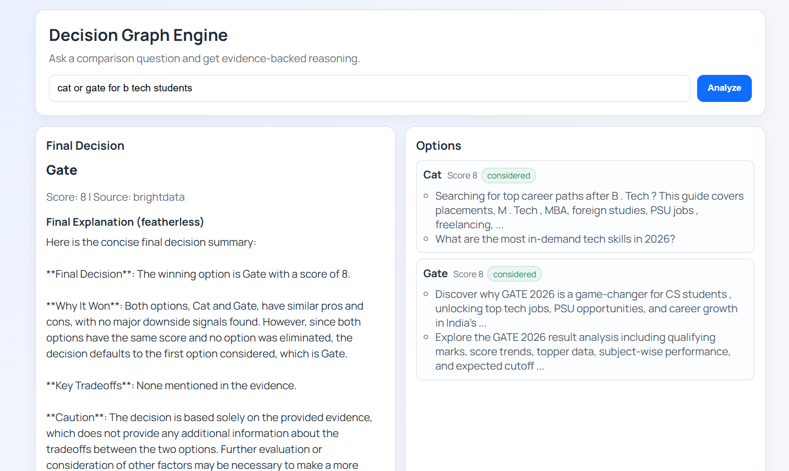
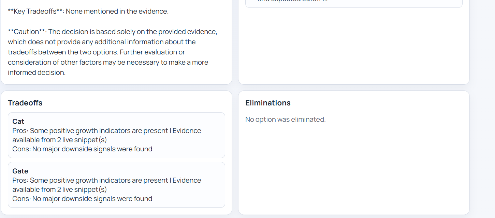
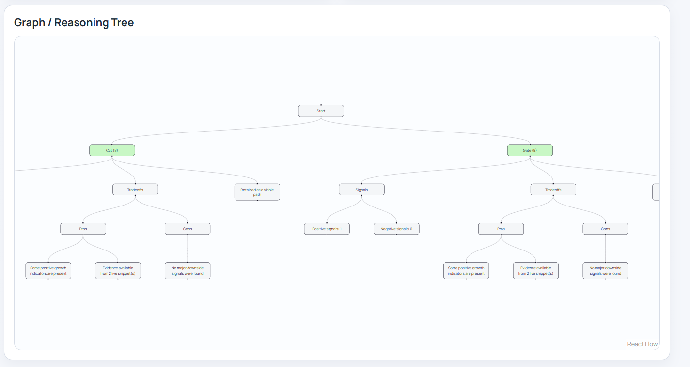

This project is an AI-powered decision support system that provides users with answers to complex comparison questions using real-world web evidence and explainable reasoning. The user is prompted to enter a question, and the system processes it using market data obtained from Bright Data, where it analyzes options using scores, trade-offs, and eliminations to arrive at a final recommendation. The final recommendation is also processed to generate a friendly explanation using Featherless, while the entire reasoning process is visualized in a decision graph so that users can easily follow how the final conclusion was arrived at. The technologies used include React and React Flow on the frontend and Node.js with Express on the backend, alongside other libraries such as CORS, dotenv, and node-fetch used in communication with APIs. This project is a full-stack application that integrates data retrieval, decision-making, explanation using an LLM, and visualization using a graph in a single process.

